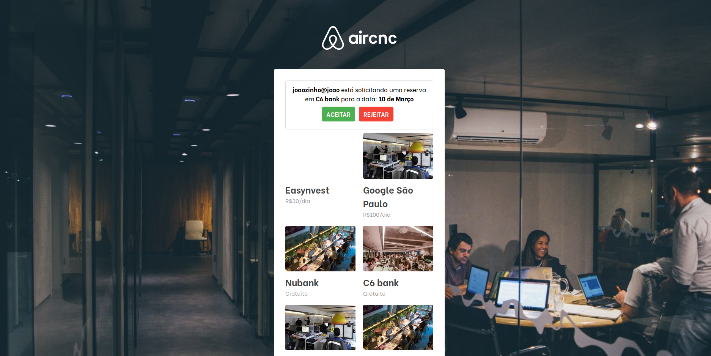

# Mobile application made in React Native, Web in ReactJS and BackEnd in NodeJS

<h2 align="center">
    Screenshot web application
</h2>

The first page shows a short registration form, where the user enters his email.

After completing the registration form, the user will come across their registered Spots.

In this page the user can register a new Spot, with a photo of the place and will complete the form by entering the company name, the technologies used and the price of the visit.

A notification will appear if any user who is interested in making a reservation to visit the place.
He will have the option to accept or decline the reservation.

<h2 align="center">
    Screenshot mobile application
</h2>

When the user opens the app, they will log in with their email and enter their favorite programming languages.

When the user completes their login they will be redirected to the spot list screen with companies using their favorite programming languages.

On this page, the user can make a booking by entering the booking date.

Shortly after booking a notification will appear showing that your booking was successful.

This notification will appear if the spot creator accepts or declines the user's booking booking.
